# RouteLoop

> Plan a ride, keep it private, and share it with exactly the people you choose.


**RouteLoop** is a web app for riders who want to save their motorcycle routes and share them deliberately. Register an account, build a personal library of routes that are private by default, and hand a specific route to specific people by email. The recipients see that route on a rich, interactive map complete with role-based waypoints, mileage breakdowns, and downloadable track files. Nobody else does.

It is the multi-user successor to a single-rider static map site. The map experience is being rebuilt on a modern stack so it can carry accounts, ownership, and per-route sharing rather than a folder of flat files.

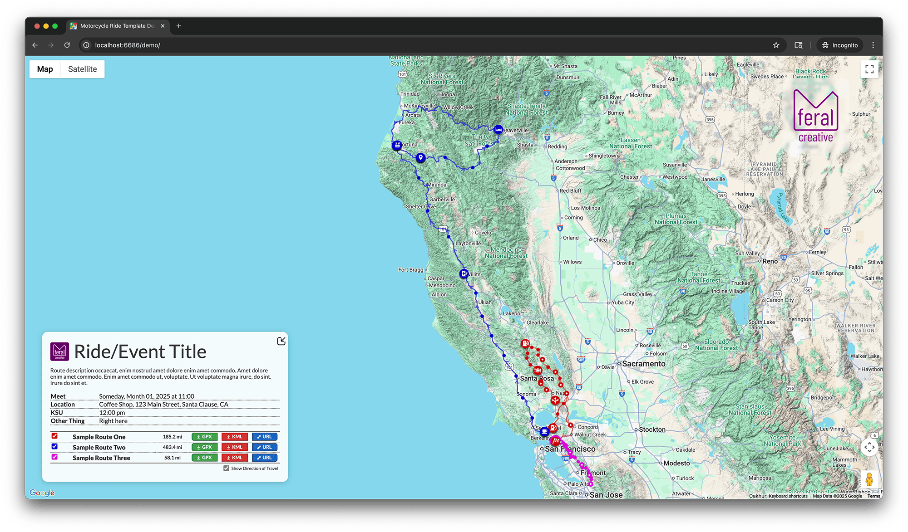

## Status

RouteLoop is in early development. The product described below is the target, not a shipping release.

What exists today in this repository:

- The inherited **design system and assets**: the full set of waypoint marker icons, the route color palette, panel and legend styling (SCSS), and brand artwork.
- A minimal landing shell and project scaffolding.

What is being built next:

- The **Angular + Firebase application** itself. None of the app code has been written yet.
- The **map rendering**, reimplemented in Angular. The original vanilla-JavaScript implementation lives in the source project and is kept only as a reference for the port (see [Credits](#credits-and-acknowledgments)).

The public app will live at **routeloop.app** (coming soon).

## Features

The capabilities below define what RouteLoop is being built to do.

- **Accounts.** Riders register and sign in with Firebase Authentication.
- **Private routes.** A signed-in user creates and saves routes that are private by default, owned by that user and stored in Firestore.
- **Share by email.** A route's owner can share it with specific people by email address. Only those recipients, plus the owner, can view it.
- **Rich map experience.** Routes render on Google Maps as colored polylines with role-based waypoint markers (fuel, food, lodging, meet-ups, scenic stops, and more), automatic mileage including distance since the last fuel or charge stop, and per-route download buttons for GPX, KML, and source-map URLs.
- **Bring your own route.** Import a `.kml` or `.gpx` file and RouteLoop parses the geometry, draws the path, and detects waypoint roles from their names.

## How it works

RouteLoop is a single-page application backed entirely by Firebase. There is no custom server to operate.

- **Frontend:** Angular (standalone components), with [`@angular/fire`](https://github.com/angular/angularfire) for Firebase integration and [`@angular/google-maps`](https://github.com/angular/components/tree/main/src/google-maps) wrapping the Google Maps JavaScript API so the map logic lives in idiomatic Angular.
- **Authentication:** Firebase Authentication handles registration, sign-in, and the verified email identity that sharing depends on.
- **Data:** Cloud Firestore stores route metadata, ownership, and the per-route list of people a route is shared with. Raw uploaded `.kml` / `.gpx` files are kept in Cloud Storage, with parsed geometry stored alongside in Firestore for fast rendering.
- **Maps:** A referrer-restricted Google Maps key is supplied through Angular environment configuration (no build-time server injection).
- **Hosting:** Firebase Hosting serves the compiled app.

The hard part of the design is the share-by-email security model: Firestore security rules authorize against the requester's verified `request.auth.token.email`, matched against each route's shared-recipient list, so that only the owner and named recipients can read a private route.

## Roadmap

Delivery is phased. Each phase builds on the previous one.

- **Phase 0 — Foundation.** Scaffold the Angular app, wire up the Firebase project (Auth, Firestore, Storage, Hosting), and stand up routing and environment config.
- **Phase 1 — Map.** Port the map rendering to Angular: KML/GPX parsing, polyline drawing, role-based waypoint markers, the color palette, and mileage calculations.
- **Phase 2 — Accounts.** Registration and sign-in with Firebase Authentication, including the email-verification policy that sharing relies on.
- **Phase 3 — Private routes.** Create, save, and manage routes that are private by default, owned per user in Firestore, with raw files in Cloud Storage.
- **Phase 4 — Sharing.** Share a route with specific people by email, enforced by Firestore security rules, with revocation.

Backlog ideas under consideration:

| Idea | Notes |
| ---- | ----- |
| Email a route | Send `.kml` / `.gpx` files to recipients rather than only downloading them. |
| Social sharing and embeds | Shareable links and embeddable map snippets. |
| Club and group branding | Let a club or riding group brand their shared routes with a logo or banner. |
| Multi-route trips | Lightweight navigation across a trip made up of several linked routes. |

## Waypoint types and icons

Every waypoint on the map can carry a type that selects the icon used to represent it. The icon set ships with RouteLoop and is designed for dynamic recoloring so markers can match their route's color.

### Standard waypoints

Waypoints with no recognized type fall back to a dot, styled by whether you placed them by hand or your routing app added them automatically.

| Type | Icon | Notes |
| ---- | ---- | ----- |
| Manual |  | A waypoint you placed yourself in your routing app. |
| Automatic |  | A waypoint added automatically by your routing app. |

### Custom waypoints

To assign a custom icon, name the waypoint in your routing software with a type prefix:

```text
TYPE - Waypoint Name
```

`TYPE` is one of the supported types below (for example, `GAS - Chevron Station`). To stack multiple types on one waypoint, separate them with a slash:

```text
GAS/BREAK/LUNCH - Waypoint Name
```

#### Logistical

| Type | Icon | Also matches |
| ---- | ---- | ------------ |
| START | 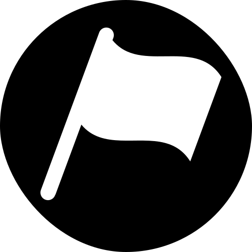 | BEGIN |
| FINISH | 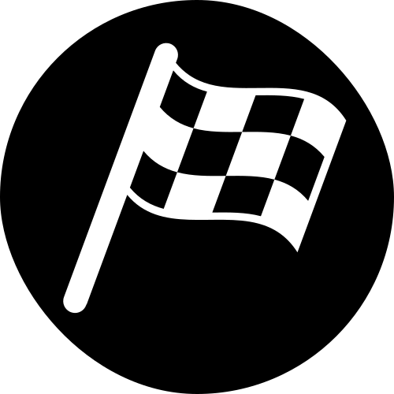 | END |
| HOME | 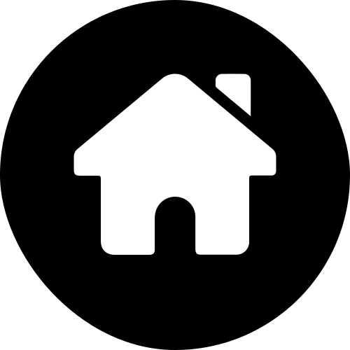 | HOUSE |
| MEET | 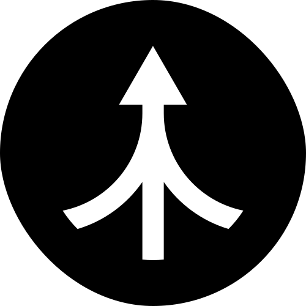 | MEETUP, JOIN, MEETING, CONVERGE |
| SPLIT | 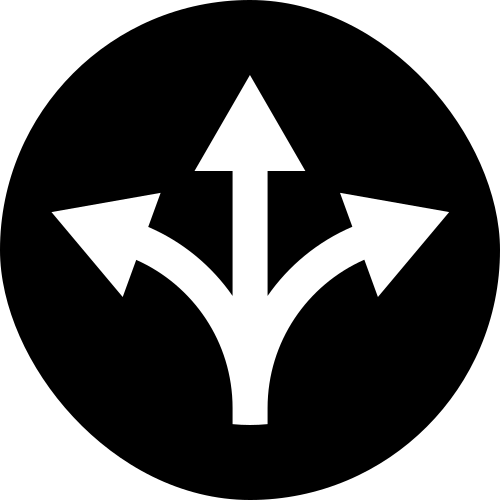 | DEPART, DIVERGE, LEAVE |

#### Journey essentials

| Type | Icon | Also matches |
| ---- | ---- | ------------ |
| GAS | 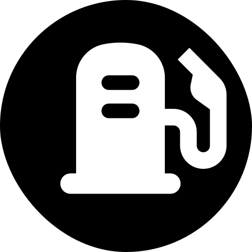 | FUEL |
| CHARGE | 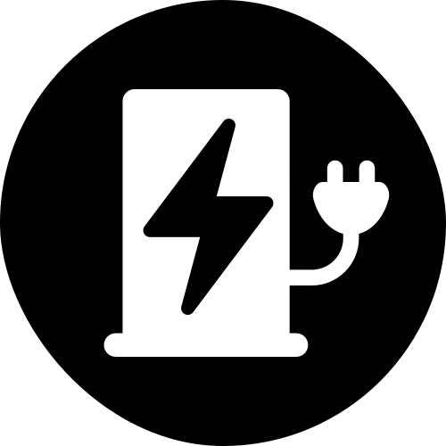 | CHARGER |
| BREAK | 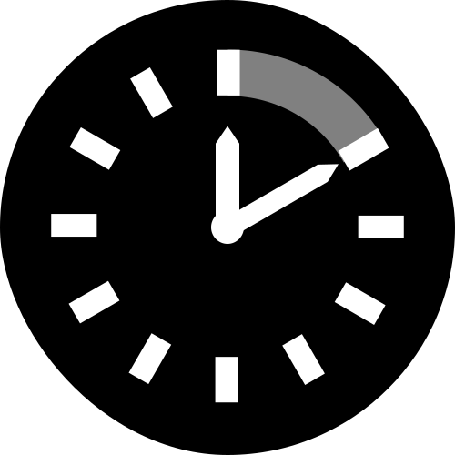 | REST |

#### Amenities and comfort

| Type | Icon | Also matches |
| ---- | ---- | ------------ |
| CAMP | 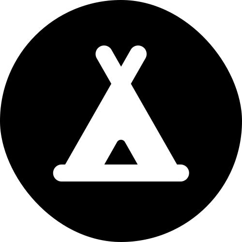 | CAMPGROUND, CAMPING |
| HOTEL | 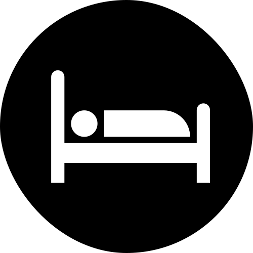 | LODGING, MOTEL, AIRBNB, SLEEP, STAY |
| FOOD | 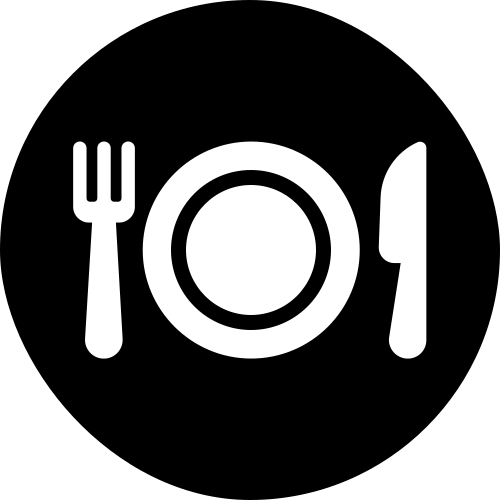 | LUNCH, DINNER, BREAKFAST |
| COFFEE | 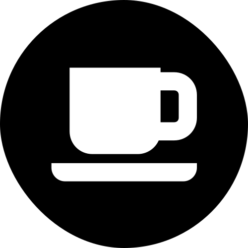 | CAFE |
| DRINKS | 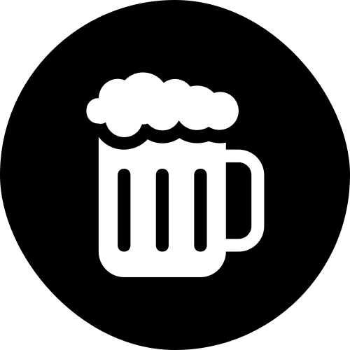 | BAR, COCKTAILS, BEER, BEERS |
| GROCERY | 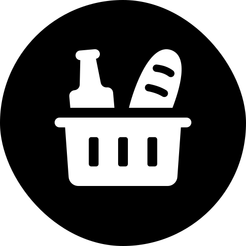 | GROCERIES |

#### Interesting and scenic

| Type | Icon | Also matches |
| ---- | ---- | ------------ |
| VIEW | 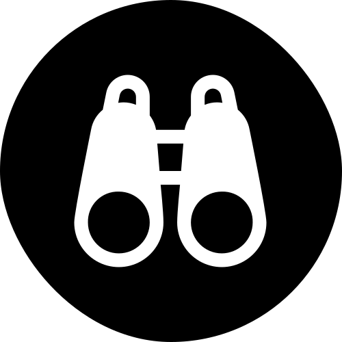 | SCENIC, LOOKOUT, VIEWPOINT |
| POI | 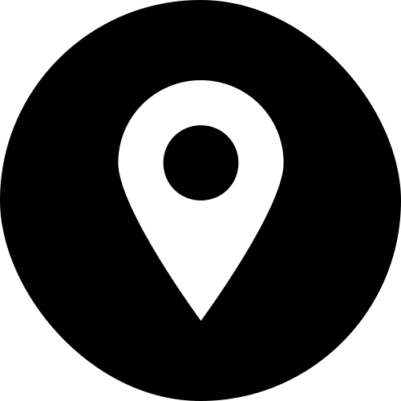 | STOP |
| WTF |  | WEIRD, RANDOM |

The icons were designed in Figma and can be copied or forked from [the RouteLoop icon file](https://www.figma.com/design/pFQck3CUIa5twKqMu1IxD5/moto-router?node-id=66-2). To let an icon take on its route's color, set its SVG `fill` to `currentColor` rather than a fixed value.

## Route colors

Each route is drawn in a distinct color from a fixed palette so overlapping routes stay legible. When there are more routes than colors, the palette cycles.

| Order | Hex | Name | Swatch |
| ----- | --- | ---- | ------ |
| 1 | `#cc0000` | Red |  |
| 2 | `#0000cc` | Blue |  |
| 3 | `#dd00dd` | Magenta | 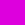 |
| 4 | `#4a148c` | Purple |  |
| 5 | `#00aaaa` | Cyan |  |
| 6 | `#ff6f00` | Orange |  |
| 7 | `#4e342e` | Brown |  |
| 8 | `#006064` | Teal |  |
| 9 | `#0d1335` | Dark Blue |  |
| 10 | `#a0740b` | Mustard |  |
| 11 | `#003300` | Dark Green |  |
| 12 | `#550000` | Burgundy |  |
| 13 | `#8800dd` | Violet | 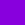 |

## Branding and logos

RouteLoop is built to be branded. The interface reserves spots for a panel logo (beside the route title) and a map logo (over the map), so a club, group, or event can put its mark on the routes it shares. The repository includes brand artwork (for example, `img/vmc-logo.svg`) as a working example, and per-group branding is on the roadmap.

## Design system reference

These details are inherited from the original implementation and kept as a reference for the Angular port. The values are accurate; the layering will be re-established as the map UI is rebuilt.

### UI color variables

The panel interface uses a small set of SCSS variables (in `style/main.scss`), distinct from the route polyline palette above.

| Variable | Value | Purpose |
| -------- | ----- | ------- |
| `$url` | `#1565c0` | URL / source-map button |
| `$gpx` | `#43a047` | GPX download button |
| `$kml` | `#d32f2f` | KML download button |
| `$text` | `#333333` | Body text |
| `$grey` | `#dddddd` | Borders and dividers |
| `$panel-bg` | `rgba(255, 255, 255, 0.9)` | Info-panel background |
| `$panel-shadow` | `rgba(0, 0, 0, 0.18)` | Info-panel shadow |

### Stacking order

The map UI layers from front to back: map logo, info panel, the panel collapse toggle, highlighted markers, standard markers, and finally route polylines.

## Getting started

> The application has not been scaffolded yet. The workflow below is the intended setup and will become live as Phase 0 lands.

Planned local development:

```sh
npm install          # install dependencies
ng serve             # run the Angular dev server
firebase emulators:start   # run Auth, Firestore, and Storage locally
```

Configuration:

- Provide a referrer-restricted Google Maps API key through Angular environment files (`src/environments/`).
- Point the app at your Firebase project via its generated config.

The legacy Express/Nunjucks server (`server.js`) carried over from the original static site is reference-only and will be removed once the Angular app is in place.

## Credits and acknowledgments

RouteLoop grew out of a single-rider static motorcycle-map site. Its waypoint icons, color palette, and panel styling are carried forward from that project, and the original vanilla-JavaScript map implementation serves as the reference for the Angular rewrite.

- Waypoint icons: [RouteLoop icon file on Figma](https://www.figma.com/design/pFQck3CUIa5twKqMu1IxD5/moto-router?node-id=66-2)
- Product home: routeloop.app (coming soon)
